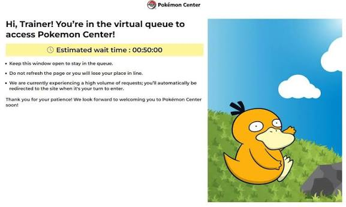

# Version 1
## Pokemon Center Queue Tracking
- URL for home page - https://www.pokemoncenter.com/en-gb
- when a new product releases, a virtual queue room will need to be entered and waited in to be able to access the site
- even if you are not interested in the new product and want to look at other products you still need to wait in the queue

### Research about Virtual Queue Room
- the URL does NOT seem to change, but this needs to be verified
- "No, the URL for the Pokémon Center UK does not change when the virtual queue is active. The site uses a shared redirect system. When your wait is over, you are automatically redirected to the main store while remaining on the same site domain" - Google AI, 2026

"Hi Trainer! You're in the virtual queue to access Pokemon Center!"

- from this screenshot we can see that the URL hasn't changed but there are keywords to look out for
- unfortunately, I will need to do my own test when there is a queue because I can't guarentee the queue will be the same every time
- but  if the bot looks for key words like "queue", "line", "wait" and etc, that may be my approach
- however it is hard not to notice that the "/en-gb" is removed from the URL when in the queue from other screenshots I have seen

### Things to Verify

- [ ] does the URL remain exactly the same?
- [ ] does the page title change?
- [ ] does the HTML structure change?
- [ ] is there a unique heading or element that Playwright can detect?
- [ ] does the queue provider expose a unique script or identifier?

### Possible approaches:

- detect keywords such as:
  - "queue"
  - "line"
  - "wait"
- detect a change in the page title
- detect a unique HTML element
- compare the DOM with the normal homepage

### Home Page Observations
on inspecting the Pokemon Center Homepage I have found interesting data that could be helpful to determine if there is a queue:

1. "<nav id="topNavPanel" class="navigation -- wofuB" role="navigation" aria-label="Main">. </nav>"
- "id="topNavPanel"" is an id I may be able to search for to determine a queue, since from the screenshot and experience the navigation bar is not usually present in the queue
- this does need to be verified in the queue

2. "<main id="main" role="main" aria-live="polite">"
- another id I am able to have the program look out for but this one could be more complicated when a queue happens as there will still be a main

### Testing Retreiving Page Title and URL from Pokemon Center
- site seems unsuitable as it has anti-bot protection
- each run would only get the results: "Page title: pokemoncenter.com Current URL: https://www.pokemoncenter.com/en-gb"
- when adding in extra measures like leaving the automated browser up so I could see what was happening, found it was an Imperva protection
- this means the results were for the captcha not for the homepage

- since PC has imperva I think it is better to test a different site for the start, I am thinking Chaos Cards or Magic Madhouse
- for these sites I will have to use a single product as I'm not sure if they do queues for new products, I think they are just preorders

### Queue HTML
- "<h1 class="waiting-text-heading mb" data-i18n="heading">
              Hi, Trainer! You're in the virtual queue to enter Pokémon Center!
            </h1>"

## Chaos Cards
- running a similar test on https://www.chaoscards.co.uk/prod/elite-trainer-boxes-pokemon/pokemon-mega-evolution-pitch-black-elite-trainer-box and keeping the browser open to see if there was any verification it is looking much better, there was no anti bot measures to stop my check

### Inspecting the page
on inspecting that specific product page there were a lot of finds that are interesting:

1. "<h1 id="prod_title" class="product__title">Pokemon Mega Evolution Pitch Black Elite Trainer Box</h1>"
- easy readable header for the product and easy non generated id

2. "
 Out of stock 
"
- easy findable stock status

now to check a page that does have stock:
https://www.chaoscards.co.uk/prod/japanese-pokemon/pokemon-abyss-eye-japanese-booster-box-30-packs

1. "<h1 id="prod_title" class="product__title">Pokemon Abyss Eye Japanese Booster Box (30 Packs)</h1>"
- same set up as before, this can mean this is a variable to search for specific products with playwright

2. "
 In stock 
"
- as we can see the same class is used and just the text is changed

### Chaos Cards seeming promising
- upon more research CC's URLs change based on filter preferences which allows me to apply all filters needed and then use that as the base URL to scrape

- examples:

1. Default ETB URL
- https://www.chaoscards.co.uk/shop/card-games/pokemon/elite-trainer-boxes-pokemon

2. ETB with OOS filter applied
- https://www.chaoscards.co.uk/shop/card-games/pokemon/elite-trainer-boxes-pokemon/sort/release-date-newest-first/oos/yes
- adds "/sort/release-date-newest-first/oos/yes" to the end of the default URL which clearly shows the filter

### Plan moving forward
1. test a product that:
- is in stock
- is not in stock
- is available for preorder
- is not available for preorder

2. scrape first page of chosen categories
- https://www.chaoscards.co.uk/shop/card-games/pokemon/elite-trainer-boxes-pokemon/sort/release-date-newest-first/oos/yes - ETBs
- https://www.chaoscards.co.uk/shop/card-games/pokemon/gift-tins-pokemon/sort/release-date-newest-first/oos/yes - gift tins
- https://www.chaoscards.co.uk/shop/card-games/pokemon/booster-packs-pokemon/sort/release-date-newest-first/oos/yes - only booster bundles

now I've only chosen the first page because that is where all the newest stock will be and upon inspection at the end of the page is sets that are unlikely to reprint
- however, maybe I can track items that I'm interested in and get the scraper to check the other pages for those specific items

3. save the data found into a database
- using SQLite it should be pretty straight forward for this but separate the items by the set

4. use the changes in the DB to alert and send a message into a discord server
- have roles related to the sets so that when a set has a restock only the people with that role are notified
